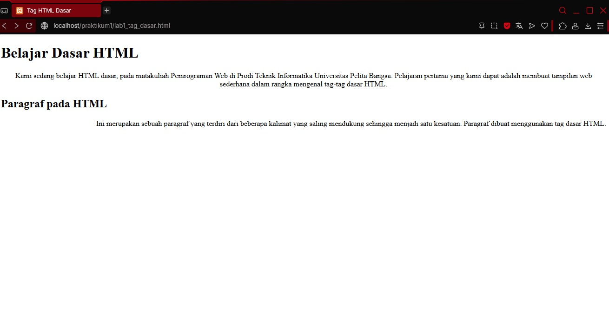

# Laporan Praktikum 1

## Jawaban Pertanyaan

### 1. Perubahan kode dan error pada penulisan tag

- Jika ada **kesalahan penulisan tag** (misalnya `<p>` ditutup dengan `</pp>` atau `<im>` bukannya ``), browser biasanya **tidak menampilkan error langsung** seperti bahasa pemrograman.
- Dampaknya: tampilan halaman bisa **berantakan** (teks tidak terformat, gambar tidak muncul, dll), tapi **tidak ada pesan error** yang muncul.

---

### 2. Perbedaan `<p>` dan `<br>`

- `<p>` → Membuat **paragraf baru**. Browser otomatis memberi jarak (margin) di atas dan bawah teks.
- `<br>` → Hanya membuat **baris baru (line break)** tanpa memberi jarak antar paragraf.

**Contoh:**

```html
<p>Ini paragraf pertama.</p>
<p>Ini paragraf kedua.</p>

Ini baris pertama.<br />
Ini baris kedua.
```

### 3. Perbedaan atribut title dan alt pada 

- `alt`: Teks alternatif yang muncul jika gambar gagal dimuat, juga digunakan untuk aksesibilitas (dibaca oleh screen reader).

- `title`: Teks yang muncul sebagai tooltip ketika kursor diarahkan ke gambar.

**Contoh:**

```html
Copy code

```

### 4. Atribut width dan height pada gambar

Sebaiknya hanya salah satu yang diisi (misalnya hanya width), supaya browser menyesuaikan sisi lainnya agar proporsional.

Jika keduanya diisi dengan nilai yang tidak sesuai rasio asli gambar, maka gambar akan terdistorsi (gepeng/melar).

### 5. Atribut target pada link

- `_blank` → Membuka link di tab/jendela baru.

- `_self` → Membuka link di tab yang sama (default).

- `_top` → Membuka link di halaman penuh, menimpa semua frame.

- `_parent` → Membuka link di frame induk dari frame tempat link itu berada.

**Contoh:**

```html
Copy code
<a href="https://example.com" target="_blank">Buka Tab Baru</a>
<a href="https://example.com" target="_self">Buka di Tab Ini</a>
<a href="https://example.com" target="_top">Buka di Halaman Penuh</a>
<a href="https://example.com" target="_parent">Buka di Frame Induk</a>
```

## Penjelasan Setiap Langkah

### 1. Membuat Paragraf

Tag `<p>` untuk menuliskan paragraf


### 2. Menambahkan Judul

Tag `<h1>` untuk menambahkan judul, memiliki 6 level sampai h6


## 3. Memformat Teks

Tag `<mark>` untuk highlight teks, `<u>` untuk membuat underline, `<i>` untuk membuat italic, `<b>` untuk membuat menjadi bold


## 4. Menyisipkan Gambar

Tag `` digunakan untuk menyisipkan gambar, link gambar disimpan di dalam properti `src`


## 5. Menambahkan Hyperlink

Tag `<a>` digunakan untuk menjadi hyperlink, sedangkan link tujuan disimpan dalam properti `href`

